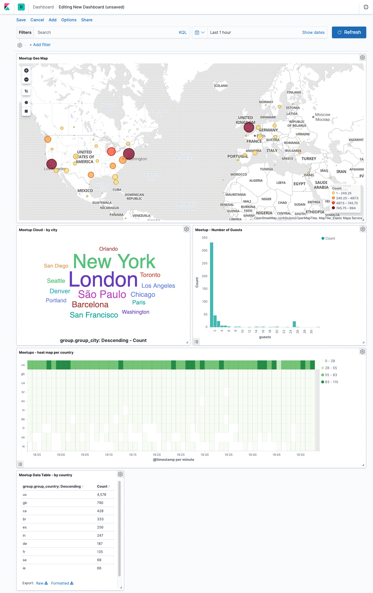

# Visualizing meetup reservations in the Elastic Stack

This repository contains a couple of configuration files to monitor the public
meetup.com reservation stream via filebeat and index data directly into the
Elasticsearch, and also automatically installs a nice to watch dashboard.

All you have to do to test it out is running `docker-compose up` - which means,
the only requirement for this is docker and docker-compose.

## Data flow

The data flow is quickly explained

1. The `filebeat` docker container runs a curl call that is piped into the `stdin` of filebeat
2. The structure of the meetup stream is one event per line. Each line is a valid JSON document.
3. filebeat reads from stdin and modifies, and modifies each event to have a proper structure for indexing geo points
4. In order to properly index geo points, the index template is extended
5. A dedicated meetup dashboard is loaded at filebeat startup
6. Open the dashboard and see meetup reservations happen in real time

## This is a demo, not an enterprise grade thing

While there are tons of optimizations possible, like not indexing filebeat
specific data, this has been solely created for demo purposes and should be
treated as such.

PRs are welcome!

